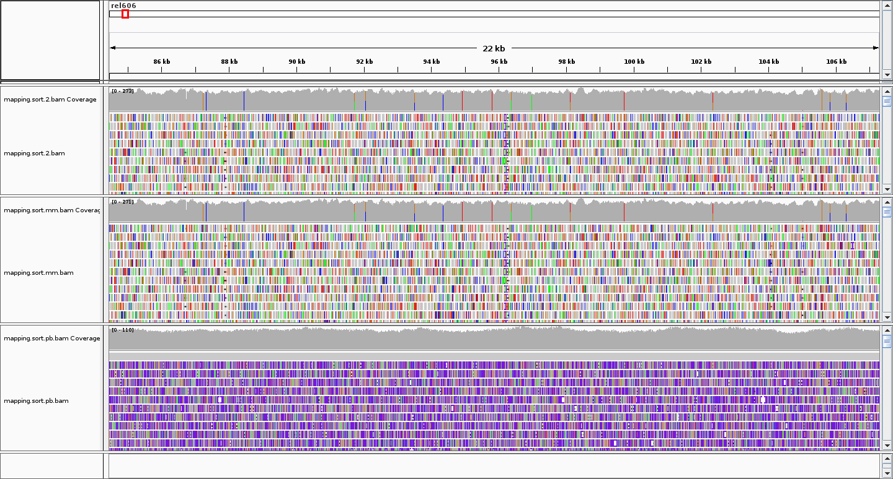

# 实验二 Mapping  
## 一、实验目的  
1. 理解比对（[mapping, alignment](https://www.eurl-ar.eu/CustomerData/Files/Folders/31-training-course-kgs-lyngby-2018/435_alignment-and-mapping-philip-clausen.pdf)）的含义  
2. 理解全局比对和局部比对的区别和应用  
3. 掌握应用bwa, minimap2, samtools的使用  
4. 理解SAM, BAM文件格式  

## 二、知识回顾  

### 比对的两种策略  
1. Global alignment
2. Local alignment

我们熟悉的blast和blat均属于第二类。   
另外，不同长度的reads比对所用的策略也不一样，对于短reads，基于local alignment的软件如blast, blat不适合。  
将短的reads回帖到长的参考基因组上，这一过程称之为mapping。一般reads数目很大，读长短，参考基因组较长，对于mapping软件有两个要求：

> 1. 速度
> 2. 准确性
 
Mapping软件众多，比较有名的包括bwa, soap, bowtie, novoalign  
另外，由于真核生物mRNA不含有内含子，与一般的DNA mapping软件要求不一样，故转录组mapping使用的软件也不一样，转录组mapping软件比较有名的包括：STAR, hisat  
本实验主要介绍一般意义上的DNA mapping软件的使用。  

### What makes mapping challenging?（挑战）
1. Volume of data
2. Garbage reads
3. Errors in reads, and quality scores
4. Repeat elements and multicopy sequence
5. SNPs/SNVs
6. Indels
7. Splicing (transcriptome)

### 几个影响mapping速度的参数  
1. How many mismatches to allow?
2. Report how many matches?
3. Require best match, or first/any that fit criteria?

## 三、上机操作  
### 进入genomelab环境
```shell
$ source /opt/miniconda3/bin/activate
$ conda activate genomelab
```
### 创建工作目录  
```shell
$ cd YourStudentID/genomicLab
$ mkdir lab2
$ cd lab2
$ mkdir data
$ mkdir results
```

### 实验数据  
> /data/stdata/genomic/lab02/data/ref.fa (参考序列)  
> /data/stdata/genomic/lab02/data/reads_1.fq.gz, /data/stdata/genomic/lab02/data/reads_2.fq.gz (illumina reads)  
> /data/stdata/genomic/lab02/data/pb_ecoli_0001.fastq (pacbio reads)  

### (一) Mapping the short reads to the reference genome using bwa   
#### 1. 准备数据和index参考基因组  
```shell
$ cd data
$ ln -s /data/stdata/genomic/lab02/data/reads_* ./
$ ln -s /data/stdata/genomic/lab02/data/ref.fa ./
$ ln -s /data/stdata/genomic/lab02/data/pb_ecoli_0001.fastq ./

$ samtools faidx ref.fa
$ mkdir index
$ cd index
$ ln -s ../ref.fa ./
```

#### 2. 建索引  
work_bwaIndex.sh  
```shell
#!/bin/bash
#$ -S /bin/bash
#$ -N INDEX
#$ -j y
#$ -cwd

bwa index ref.fa
```

```shell
# 用qsub提交任务至计算节点
$ qsub work_bwaIndex.sh
```

#### 3. Mapping the reads to the reference genome using bwa  
```shell
cd ../../results
```

work_bwa.sh  
```shell
#!/bin/bash
#$ -S /bin/bash
#$ -N bwa
#$ -j y
#$ -cwd

bwa mem ../data/index/ref.fa ../data/reads_1.fq.gz ../data/reads_2.fq.gz | \
  samtools view -b - | \
  samtools sort -o mapping.sort.bwa.bam -
samtools index mapping.sort.bwa.bam
```

```shell
# 用qsub提交任务至计算节点
$ qsub work_bwa.sh
```

### (二)Mapping the short reads to the reference genome using minimap2  

work_minimap2.sh  
```shell
#!/bin/bash
#$ -S /bin/bash
#$ -N minimap2
#$ -j y
#$ -cwd

minimap2 -ax sr ../data/ref.fa ../data/reads_1.fq.gz ../data/reads_2.fq.gz | \
 samtools view -b - | \
 samtools sort -o mapping.sort.mm.bam -
samtools index mapping.sort.mm.bam
```

```shell
# 用qsub提交任务至计算节点
$ qsub work_minimap2.sh
```

### (三) Mapping the long reads to the reference genome using minimap2  
work_minimap_pb.sh  
```shell
#!/bin/bash
#$ -S /bin/bash
#$ -N mm_map-pb
#$ -j y
#$ -cwd

minimap2 -ax map-pb ../data/ref.fa ../data/pb_ecoli_0001.fastq | \
 samtools view -b - | \
 samtools sort -o mapping.sort.pb.bam -
samtools index mapping.sort.pb.bam
```

```shell
# 用qsub提交任务至计算节点
$ qsub work_minimap_pb.sh
```

### (四) 显示和比较比对结果  
使用IGV查看比对结果  
 

## 四、作业与思考  
1. 先组装，得到contigs (assemble short reads using SPAdes, assemble pacbio long reads using canu | mecat | miniasm)  
2. 然后将contigs用bwa mem比对到参考基因组上  
3. 用igv显示比对结果   

## 五、参考资料  
[bwa](https://github.com/lh3/bwa)  
[minimap2](https://github.com/lh3/minimap2)  
[samtools](http://www.htslib.org/)  
[IGV](http://software.broadinstitute.org/software/igv/)  

