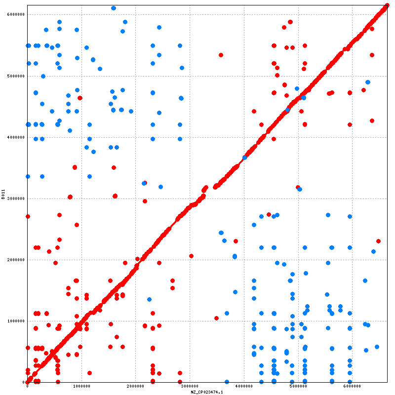

# 实验四 全基因组比对 Whole genome alignement  
## 一、实验目的  
1. 了解全基因组序列比对与一般意义上的多序列比对异同  
2. 掌握mummer, mauve的用法

## 二、知识回顾  
Whole-genome alignment (WGA) is the prediction of evolutionary relationships at the nucleotide level between two or more genomes. It combines aspects of both colinear sequence alignment and gene orthology prediction, and is typically more challenging to address than either of these tasks due to the size and complexity of whole genomes. Despite the difficulty of this problem, numerous methods have been developed for its solution because WGAs are valuable for genome-wide analyses, such as phylogenetic inference, genome annotation, and function prediction. In this chapter, we discuss the meaning and significance of WGA and present an overview of the methods that address it. We also examine the problem of evaluating whole-genome aligners and offer a set of methodological challenges that need to be tackled in order to make the most effective use of our rapidly growing databases of whole genomes.  

## 三、上机操作  
### 数据存放位置及工作目录准备  
```
/data/lab/genomic/lab04/data
$ mkdir data results
$ cd data
$ ln -s /data/lab/genomic/lab04/data/*.fasta ./
$ cd ../results
```
### 1. 两个基因组WGA  

work_nucmer.sh
```
#PBS -N nucmer
#PBS -l nodes=1:ppn=1
#PBS -j oe
cd $PBS_O_WORKDIR
nucmer -p X23_B011 ../data/X23.fasta ../data/B011.fasta
```
结果文件：X23_B011.delta  
查看结果  
```
$ mummerplot --layout --medium X23_B011.delta 
$ mummerplot --layout --medium --png -p X23_B011 X23_B011.delta 
```



### 2. 多基因组WGA

```
$ cat ../data/*.fasta > genome.fasta
```

work_mauve.sh  
```
#PBS -N nucmer
#PBS -l nodes=1:ppn=1
#PBS -j oe
cd $PBS_O_WORKDIR
progressiveMauve --layout --output=my_seqs.xmfa genome.fasta 
```
查看结果  
```
$ Mauve
```


## 四、作业与思考  

## 五、参考文献  
