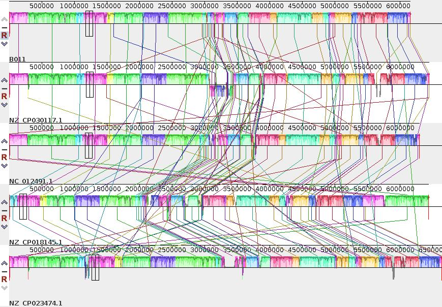

# 实验四 全基因组比对 Whole genome alignement  
## 一、实验目的  
1. 了解全基因组序列比对与一般意义上的多序列比对异同  
2. 掌握mummer, mauve的用法

## 二、知识回顾  
Whole-genome alignment (WGA) is the prediction of evolutionary relationships at the nucleotide level between two or more genomes. It combines aspects of both colinear sequence alignment and gene orthology prediction, and is typically more challenging to address than either of these tasks due to the size and complexity of whole genomes. Despite the difficulty of this problem, numerous methods have been developed for its solution because WGAs are valuable for genome-wide analyses, such as phylogenetic inference, genome annotation, and function prediction. In this chapter, we discuss the meaning and significance of WGA and present an overview of the methods that address it. We also examine the problem of evaluating whole-genome aligners and offer a set of methodological challenges that need to be tackled in order to make the most effective use of our rapidly growing databases of whole genomes.  

## 三、上机操作  
### 进入genomelab环境
```
$ source /opt/miniconda3/bin/activate
$ conda activate genomelab
```

### 数据存放位置及工作目录准备  
```
# Data: /data/lab/genomic/lab04/data
$ mkdir lab4
$ cd lab4
$ mkdir data results
$ cd data
$ ln -s /data/lab/genomic/lab04/data/B011.fasta
$ ln -s /data/lab/genomic/lab04/data/NF2.fasta
$ ln -s /data/lab/genomic/lab04/data/X23.fasta
$ cd ../results
```

### 1. 两个基因组WGA
work_nucmer.sh
```
#!/bin/bash
#$ -S /bin/bash
#$ -N nucmer
#$ -j y
#$ -cwd
nucmer -p X23_B011 ../data/X23.fasta ../data/B011.fasta
dnadiff -p X23_B011 -d X23_B011.delta
```

```
# 提交任务
$ qsub work_nucmer.sh
```

结果文件：X23_B011.delta  
dnadiff 结果
```
OUTPUT:
    .report  - Summary of alignments, differences and SNPs
    .delta   - Standard nucmer alignment output
    .1delta  - 1-to-1 alignment from delta-filter -1
    .mdelta  - M-to-M alignment from delta-filter -m
    .1coords - 1-to-1 coordinates from show-coords -THrcl .1delta
    .mcoords - M-to-M coordinates from show-coords -THrcl .mdelta
    .snps    - SNPs from show-snps -rlTHC .1delta
    .rdiff   - Classified ref breakpoints from show-diff -rH .mdelta
    .qdiff   - Classified qry breakpoints from show-diff -qH .mdelta
    .unref   - Unaligned reference IDs and lengths (if applicable)
    .unqry   - Unaligned query IDs and lengths (if applicable)
```

查看结果  
```
$ mummerplot --layout --small --postscript -p X23_B011 X23_B011.delta
$ ps2pdf X23_B011.ps X23_B011.pdf
```

比对结果：


[mummer使用说明](https://github.com/mummer4/mummer/blob/master/MANUAL.md)

### 2. 多基因组WGA

```
$ cat ../data/*.fasta > genome.fasta
```

work_mauve.sh  
```
#!/bin/bash
#$ -S /bin/bash
#$ -N mauve
#$ -j y
#$ -cwd
mauveAligner --output=my_seqs.xmfa genome.fasta 
```

```
# 提交任务（Note: Mauve运行时间较长）
$ qsub work_mauve.sh
```

查看结果
* 集群上查看（Note: 需要X11图形支持）
```
$ Mauve my_seqs.xmfa
```

* Windows系统查看
> 1. 安装[Mauve](http://darlinglab.org/mauve/download.htmla)
> 2. 将my_seqs.xmfa下载到本地，用Mauve打开，观察结果



## 四、作业与思考  
1. 真核生物基因组全基因组比对，[参考这里](http://genomewiki.ucsc.edu/index.php/Whole_genome_alignment_howto)  
2. 如何基于全基因组序列比对构建物种进化树

## 五、参考文献  
1. [mummer](https://github.com/mummer4/mummer)  
2. [Mauve](http://darlinglab.org/mauve/mauve.html)  
3. [Modern software for whole genome alignment visualization](https://www.biostars.org/p/302859/)  
