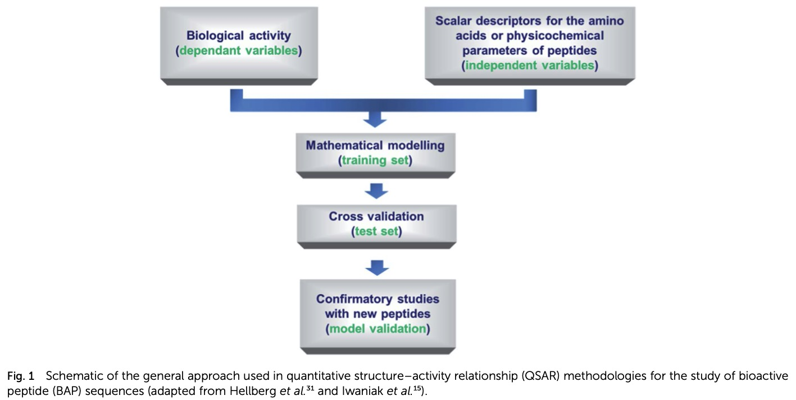

# 实验五：序列表征/数值化2(以定量构效关系建模为例)

## 实验目的
* 1）了解定量构效关系建模的研究背景
* 2）编程实现肽序列的AA531(531 properties of Amino Acids)特征表征/数值化

## 1. 定量构效关系
* 分子是物质的基本组成单位。分子结构属性决定其生理活性。
* 通过统计学、信息学方法从分子结构中提取、总结分子结构的信息与规律，有助于从理论上指导实验过程。
* 定量构效关系(Quantitative Structure-Acitivity Relationship, QSAR)是以分子的基本理化性质与相应的生理活性为基础，通过数学或统计学手段定量研究有机小分子（如抑制剂等）与生物大分子（如受体、酶等）间的相互作用。
* QSAR可用于高效生物活性分子化合物筛选、药物的环境毒性评价、新药设计与合成等。

Ref: Nongonierma AB, FitzGerald RJ. Learnings from quantitative structure–activity relationship (QSAR) studies with respect to food protein-derived bioactive peptides: a review. RSC advances. 2016;6(79):75400-13.


## 2. ACEI研究现状
* DNA序列中有更多的GT、AG为非剪接位点。因此，我们面临着一个极度不平衡的分类任务，即从含有大量非剪接位点的GT、AG中识别出极少量的真实剪接位点。
* 实验阶段：通过生物实验和序列比对方法确定剪接位点。优点：可靠性高。缺点：无法获得剪接机制的一般性结论，并且成本代价高，不利于大规模使用。
* 生物信息学方法：权重矩阵模型(WMM)，其使用每个位置的核苷酸频率表征序列[1]；加权数组方法(weighted array method, WAM)则考虑了相邻碱基之间的依赖关系，被认为是WMM的扩展[2]; GeneSplicer[3], NNsplice[4], SpliceView[5], SpliceMachine[6], MaLDoss[7]等。

## 3. 数据集
* HS<sup>3</sup>D数据集拥有从GenBank Rel.123中提取的所有人类基因外显子、内含子和剪接区域，为训练和评估基因预测模型提供了标准化的材料，是目前人类基因剪接位点预测研究通用的大型数据集[8]。该数据集包含2796/2880个真实供体/受体位点和271937/329374个虚假供体/受体位点；所有位点均遵循“GT-AG”规则，由长度为140bp的序列样本表示，其中保守的二核苷酸GT位于序列第71、72位，保守的二核苷酸AG位于序列第69、70 位；所有序列均已剔除非ACGT碱基，且已去除冗余序列。
* 从HS<sup>3</sup>D数据集的所有虚假剪接位点序列中，随机抽取2796/2880条虚假供体/受体位点序列，与所有真实剪接位点序列构建正负样本均衡的数据集。
* 供体(EI)、受体(IE)位点序列：[EI_true.seq, EI_false.seq; IE_true.seq, IE_false.seq](https://github.com/dai0992/Pattern-Recognition-and-Prediction/blob/master/Lab2_SplicingSequencesCoding/EI-true-false_IE-true-false_seq.zip)

## 4. 基于序列组分的特征：k-spaced氨基酸/碱基对组分[9]
* 被k个任意碱基隔开的碱基对(base pairs)在核酸序列中的出现频率。
* 例如：k = 2时，需计算被2个碱基隔开的所有16种碱基对在序列中的出现频率。
* 通常需要设定一个k的上限，比如KMAX = 4，分别计算k = 0, 1, ..., KMAX时的组分特征。对于任意一条核酸序列，其k-spaced碱基对组分特征维数为：16x(KMAX+1)
* k-spaced组分特征兼顾序列组分信息和碱基之间的不同尺度关联效应，并且特征维数与序列长度无关。

## 5. 工作目录准备与Python包准备
```sh
# 建立lab_02文件夹
$ mkdir lab_02
$ cd lab_02

# 首先要安装Python的包管理工具pip
$ curl https://bootstrap.pypa.io/get-pip.py -o get-pip.py   # 下载安装脚本
$ python3 get-pip.py    # 运行安装脚本

# 安装3个常用包：矩阵运算包numpy、数值计算scipy包、矩阵作图包matplotlib
$ pip3 install --user numpy scipy matplotlib -i https://pypi.tuna.tsinghua.edu.cn/simple
```

## 6. 序列表征
* 参考程序：kSpaceCoding.py
* 将以下代码保存为一个.py文件(如kSpaceCoding.py). 程序功能：读取'EI_true1.seq', 计算kSpace特征，并将结果保存至输出文件(如'EI_true1_kSpace.txt')
```python3
import numpy as np # 导入numpy包，并重命名为np

def file2matrix(filename, KMAX, bpTable):
    fr = open(filename) # 打开文件
    arrayOLines = fr.readlines() # 读取所有内容
    fr.close() # 及时关闭文件

    numberOfLines = len(arrayOLines) # 得到文件行数
    returnMat = np.zeros((numberOfLines, 16*(KMAX+1))) # 为返回的结果矩阵开辟内存
    lineNum = 0

    for line in arrayOLines:
        line = line.strip() # 删除空白符，包括行尾回车符
        listFromLine = line.split(': ') # 以': '为分隔符进行切片
        nt_seq = list(listFromLine[1]) # 取出核酸序列并转换成list
        del(nt_seq[70:72]) # 删除位于第71，72位的供体位点
        
        kSpaceVec = []
        for k in range(KMAX+1): # 计算不同k条件下的kSpace特征
            bpFreq = bpTable.copy() # bpTable是一个字典型变量，一定要用字典的copy函数，Python函数参数使用的址传递

            for m in range(len(nt_seq)-k-1): # 扫描序列，并计算不同碱基对的频率
                bpFreq[nt_seq[m]+nt_seq[m+1+k]] += 1 # 序列的子串会自动在字典中寻找对应的key，很神奇！否则要自己写if语句匹配
            bpFreqVal = list(bpFreq.values()) # 取出bpFreq中的值并转换成list
            kSpaceVec.extend(np.array(bpFreqVal)/(len(nt_seq)-k-1)) # 每个k下的特征，需除以查找的所有子串数

        returnMat[lineNum,:] = kSpaceVec
        lineNum += 1
    return returnMat, lineNum

if __name__ == '__main__':
    filename = 'EI_true1.seq'
    KMAX = 4
    bpTable = {}
    for m in ('A','T','C','G'):
        for n in ('A','T','C','G'):
            bpTable[m+n] = 0

    kSpaceMat, SeqNum = file2matrix(filename, KMAX, bpTable)
    outputFileName = 'EI_true1_kSpace.txt'
    np.savetxt(outputFileName, kSpaceMat, fmt='%g', delimiter=',')
    print('The number of sequences is %d. Matrix of features is saved in %s' % (SeqNum, outputFileName))
```
```sh
# 删除EI_true.seq的头4行描述
$ sed '1,4d' EI_true.seq > EI_true1.seq
# 运行程序（可自行在主函数中更改KMAX的值，观察结果。每次在文件中更改参数很麻烦，可自己上网搜索如何通过命令行传递参数）
$ python3 kSpaceCoding.py
```

## 作业
自己独立编写序列表征程序。不怕报错，犯错越多，进步越快！

## 参考文献
[1] Staden R. Computer methods to locate signals in nucleic acid sequences [J]. Nucleic Acids Research. 1984, 12(2):505. <br>
[2] Zhang M Q, Marr T G. A weight array method for splicing signal analysis [J]. Computer applications in the biosciences: CABIOS, 1993, 9(5):499-509. <br>
[3] Pertea M, Lin X Y, Salzberg S L. GeneSplicer: a new computational method for splice site prediction [J]. Nucleic Acids Research. 2001, 29:1185-1190. <br>
[4] Reese M G, Eeckman F H, Kulp D, et al. Improved splice site detection in Genie [J]. Journal of Computational Biology, 1997, 4(3):311-323. <br>
[5] Rogozin I B, Milanesi L. Analysis of donor splice signals in different organisms [J]. Journal of Molecular Evolution, 1997, 45(1):50-59. <br>
[6] Degroeve S, Saeys Y, Baets B D, et al. SpliceMachine: predicting splice sites from high-dimensional local context representations [J]. Bioinformatics. 2005,21:1332-1338. <br>
[7] Meher P K, Sahu T K, Rao A R. Prediction of donor splice sites using random forest with a new sequence encoding approach [J]. Biodata Mining. 2016,9:4. <br>
[8] Pollastro P, Rampone S. HS3D, a dataset of Homo sapiens splice regions and its extraction procedure from a major public database [J]. International Journal of Modern Physics C, 2002, 13(8):1105–1117. <br>
[9] Chen Y Z, Tang Y R, Sheng Z Y, et al. Prediction of mucin-type O-glycosylation sites in mammalian proteins using the composition of k-spaced amino acid pairs [J]. BMC Bioinformatics, 2008, 9(1):101-112.

## 致谢
剪接位点研究背景，部分摘自湖南农业大学博士学位论文《基于卡方决策表的分子序列信号位点预测》(2019)。<br>
感谢曾莹博士提供其学位论文！
